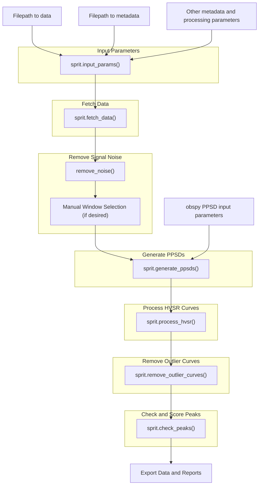

```mermaid
    graph TB
        subgraph Input Parameters
            direction LR
            A0["sprit.input_params()"]
        end
        A1[Filepath to data] --> A0
        A2[Filepath to metadata] --> A0
        A3[Other metadata and processing parameters] --> A0

        A0 --> B0["sprit.fetch_data()"]

        subgraph Fetch Data
            direction LR
            B0
        end

        B0 --> RN0["remove_noise()"]


        subgraph Remove Signal Noise
            direction LR
            RN0
            RN1
        end
        RN0 --> RN1["Manual Window Selection (if desired)"]
        RN1 --> C0["sprit.generate_ppsds()"]


        C1[obspy PPSD input parameters] --> C0
        subgraph Generate PPSDs
            direction LR
            C0
        end
        C0 --> D0["sprit.process_hvsr()"]

        subgraph Process HVSR Curves
            direction LR
            D0
        end

        D0 --> ROC0["sprit.remove_outlier_curves()"]
        subgraph Remove Outlier Curves
            direction LR
            ROC0
        end
        ROC0 --> E0["sprit.check_peaks()"]

        subgraph Check and Score Peaks
            direction LR
            E0
        end
        E0 --> F0[Export Data and Reports]
```